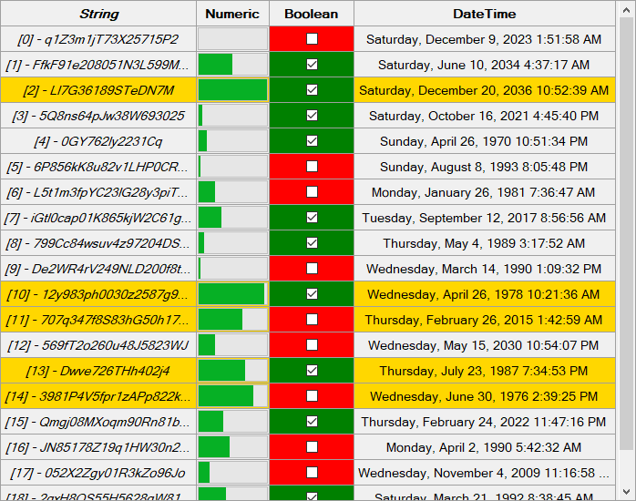

# Mission statement

Dlist aims to be a customizable, easy to use replacement for the standard .NET Framework ListView (in details mode), while avoiding the complexity of the DataGridView. This is achieved by not trying to cover every use case in existence and by keeping the object model very simple.

# Design

At the core there are only two classes, the *Dlist* and the *Column*. That's it. The objects holding the data, that is supposed to be displayed, are added directly to the *Dlist*. There are no intermediary objects like ListViewItems.
Each *Column* has a delegate that is resposible for extracting whatever is supposed to be displayed in that specific *Column*, the so called *ValueGetter*. This delegate **must** be set by the user, typically in the form of a lambda expression. By default a *Column* renders the values returned by the *ValueGetter* as text (values can also be rendered as progressbars or checkboxes).
Values can be edited. This requires, in addition to the *ValueGetter*, the *ValueSetter* and the *CellEditor* of the *Column* to be set. The *ValueSetter* is a delegate that is responsible for pushing the edited value back to the object it was originally retrieved from. The *CellEditor* provides the means to edit the value (*TextCellEditor* provides a textbox, *DateTimeCellEditor* a date picker and *BooleanCellEditor* a simple toggle on click).

# Hotkeys / Keyboard controls

Dlist features basically the same keyboards controls as Windows Explorer in details view.

## Arrow Up / Down / Left / Right

Moves the focus rectangle.

## PageUp / PageDown

Selects first / last items on the current, previous or next page depending on which item is currently selected.

## Home / End

Selects first / last item in the list.

## Space

Toggles selection for currently focused item.

## Delete

Removes selected items from the list.

## Shift / Ctrl while any of the above

Hold *Shift* to add to selection. Hold *ctrl* to change focus without changing selection.

## Crl+A

Selects all items.

## Ctrl+Shift+A

Deselects all items.

## F12

Prints some information to the console useful for debuging (only works in debug build).

# Color settings precedence

The precedence of factors determining the final colors of a cell from most important to least, are as follows:
1. CellColorEvaluator	(delegate on *Columns*)
2. ItemColorEvaluator	(delegate on *Dlist*)
3. ItemForeColor- and ItemBackColor- properties
Both color evaluator delegates can pass on determining a color to the next step by returning empty colors (*Color.Empty*).

# Custom renderers / editors

Custom cell renderers must implement *IRenderer*. Additionally *CellRendererBase* can be used as a base class for some useful functionality.
Custom header renderers must implement *IHeaderRenderer*. Additionally *CellRendererBase* can be used as a base class for some useful functionality.
Cell editors must implement *ICellEditor*. Optionally *CellEditorBase* can and in most cases probably should be used as the base class.

# Final words

To get a better idea how all this works in practice, the best place to start is the *TestForm*.